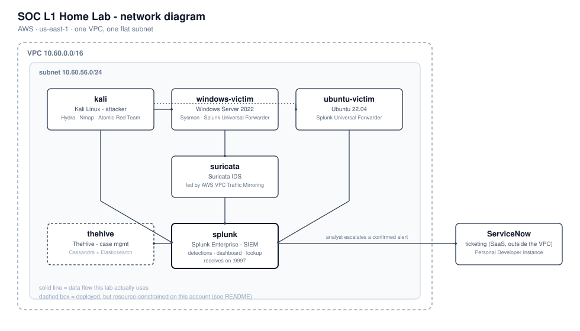
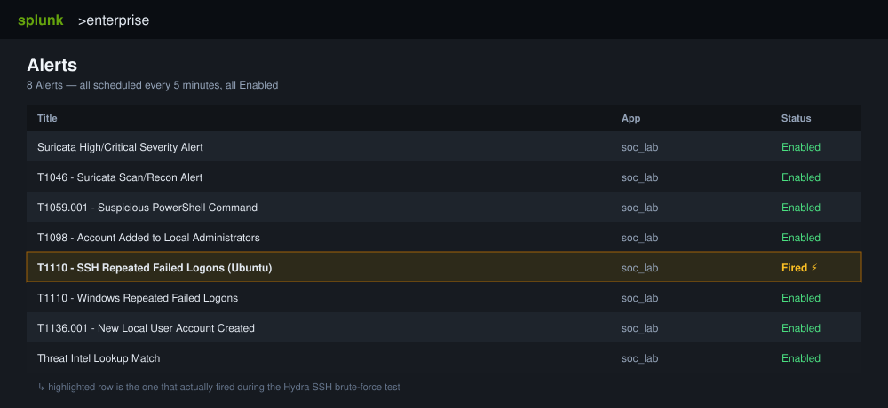
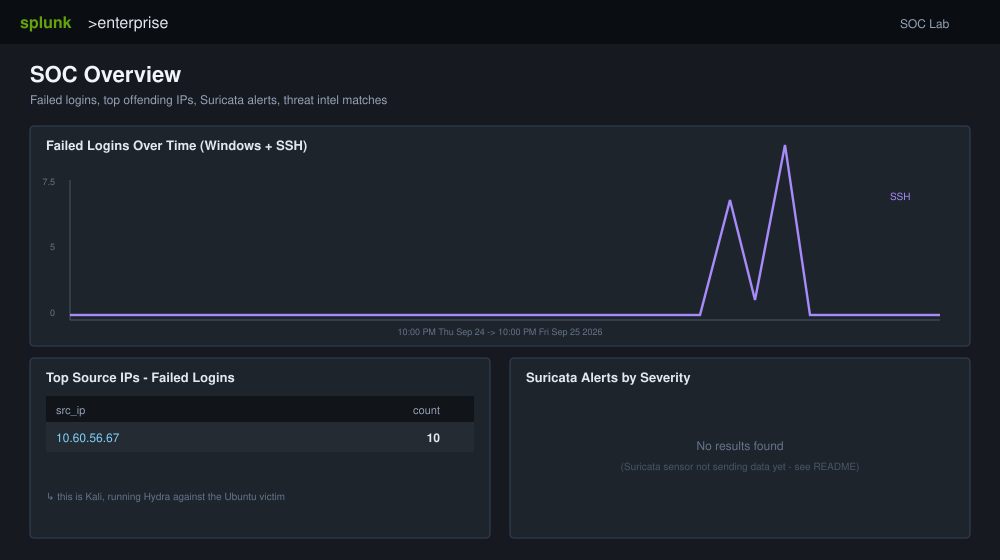
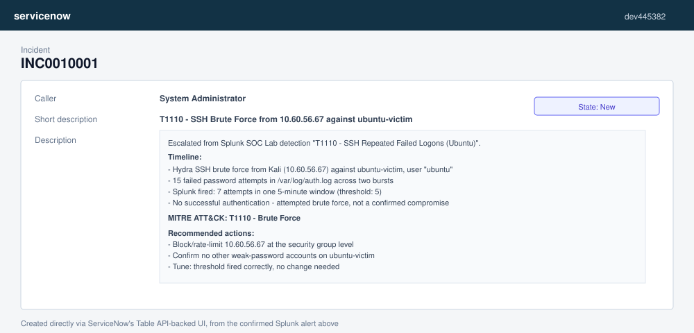

# SOC L1 Home Lab (AWS Edition)

This is a small home lab for practicing SOC L1 work: an attacker box, two
"victim" machines, a SIEM (Splunk) watching them, and a ticketing system
(ServiceNow) for escalating anything real. It runs entirely on AWS, and
Terraform builds all of it for you.

The idea: you run a real attack from the Kali box, watch Splunk notice it,
dig into the logs a bit like an analyst would, and then open a real ticket
for it. It's the same loop a Tier-1 SOC analyst runs every day, just small
enough to fit on a laptop's budget.


## The picture



Everything sits in one AWS VPC, one flat subnet - same idea as plugging a
few machines into the same switch at home.

## What's actually running

| Box | What it is | What it's for |
|---|---|---|
| `kali` | Kali Linux | the attacker - runs Hydra, Nmap, Atomic Red Team |
| `windows-victim` | Windows Server 2022 | a target, with Sysmon and PowerShell logging turned on |
| `ubuntu-victim` | Ubuntu 22.04 | a target, mainly for SSH attacks |
| `suricata` | Suricata | network intrusion detection, fed by AWS traffic mirroring |
| `splunk` | Splunk Enterprise | the SIEM - this is where the detections and dashboard live |
| `thehive` | TheHive | case management (deployed, currently underpowered - see below) |
| ServiceNow | ServiceNow PDI | where confirmed incidents get ticketed - this is a separate cloud service, not a box in the VPC |

One thing worth calling out: the original design for this kind of lab
usually includes **pfSense** as a firewall/router. We didn't deploy it here,
on purpose - in AWS, a Security Group already does pfSense's firewall job,
so adding a virtual router in front of it would just be extra moving parts
for no benefit. Suricata still does its job as its own sensor.

## Does it actually work? Yes - here's the proof

We ran this for real. From Kali, we launched an SSH brute-force attack
(Hydra) against the Ubuntu victim. Here's what happened, step by step.

**1. Splunk saw it and raised the right alert.**

Of the 8 detections deployed, the SSH brute-force one fired - because a real
attack matching that pattern actually happened.



**2. The dashboard showed it clearly.**

The "Failed Logins Over Time" panel spiked right when the attack ran, and
the attacker's IP (Kali) showed up at the top of the offender list.



**3. We escalated it into a real ticket.**

Instead of leaving it in Splunk, we wrote up what we found - timeline,
technique, recommended next steps - and opened it as an actual incident in
ServiceNow.



That's the whole loop: **attack -> detect -> investigate -> escalate**, done
for real, not just described on paper.

## Being honest about what doesn't work yet

- **TheHive is deployed but currently unresponsive.** It needs Cassandra +
  Elasticsearch running alongside it, which wants more memory than this
  AWS account currently allows us to use (more on that below). Until that's
  resolved, we escalate straight to ServiceNow instead - which is exactly
  what the screenshots above show.
- **Suricata isn't sending alerts yet.** There's a known startup-ordering
  bug (its network interface comes up *after* Suricata tries to use it).
  Diagnosed, just not patched yet.
- **The AWS account this was built on is brand new**, and AWS limits new
  accounts to small "Free Tier" instance sizes for a little while. That's
  why everything above is running on `t3.small` rather than something
  beefier - it's what was available. Once that restriction lifts, TheHive
  in particular should come back to life without any other changes.

None of that changes the core result: the detection pipeline is real, and
we proved it with a real attack, not a demo script.

## Want to build it yourself?

Read the docs in this order:

1. [docs/01-prerequisites.md](docs/01-prerequisites.md) - accounts, keys, and one manual AWS Marketplace step
2. [docs/02-deploy.md](docs/02-deploy.md) - running `terraform apply` and what to expect
3. [docs/03-splunk-setup.md](docs/03-splunk-setup.md) - logging in and checking the detections landed
4. [docs/04-thehive-servicenow.md](docs/04-thehive-servicenow.md) - setting up TheHive and ServiceNow
5. [docs/05-attack-scenarios.md](docs/05-attack-scenarios.md) - the actual attacks to try, step by step
6. [docs/06-cost-and-teardown.md](docs/06-cost-and-teardown.md) - what this costs, and how to shut it all down cleanly

## What's in this repo

```
terraform/            Everything AWS-side: the network, security groups, and every instance
scripts/user_data/    The setup script each machine runs the first time it boots
scripts/sysmon/       Sysmon config for the Windows victim
scripts/splunk/       The detections, dashboard, and threat-intel lookup Splunk uses
scripts/thehive/      TheHive's docker-compose setup
scripts/integration/  A small script that can push TheHive cases into ServiceNow
docs/                 Step-by-step guides, in the order listed above
docs/images/          The diagram and screenshots used in this README
```

## One safety note

The attack traffic in this lab (Hydra, Nmap, Atomic Red Team) stays inside
this one VPC, aimed only at the two victim boxes built for that purpose.
Don't point any of it at anything else.
